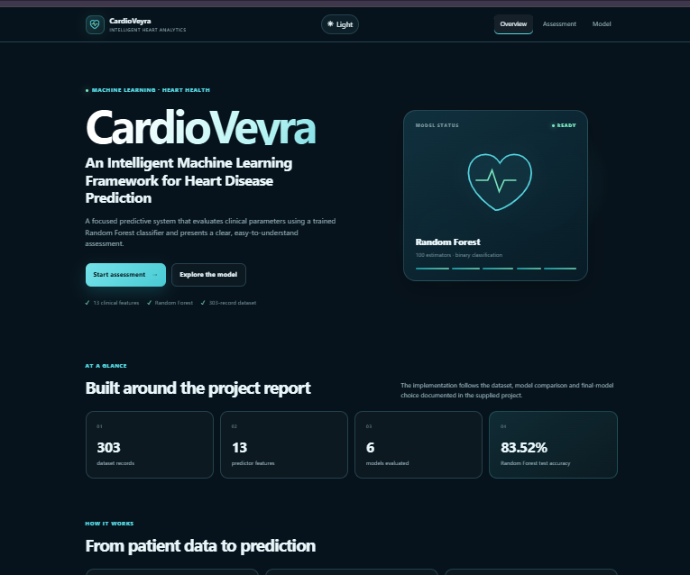
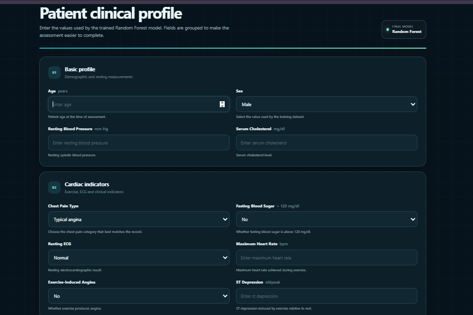
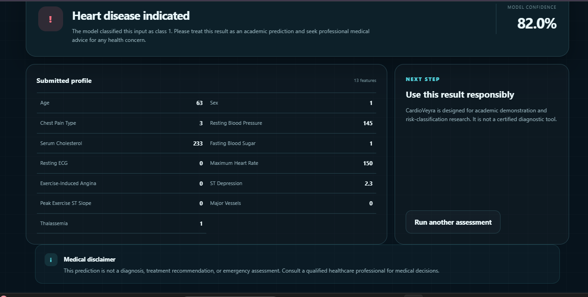
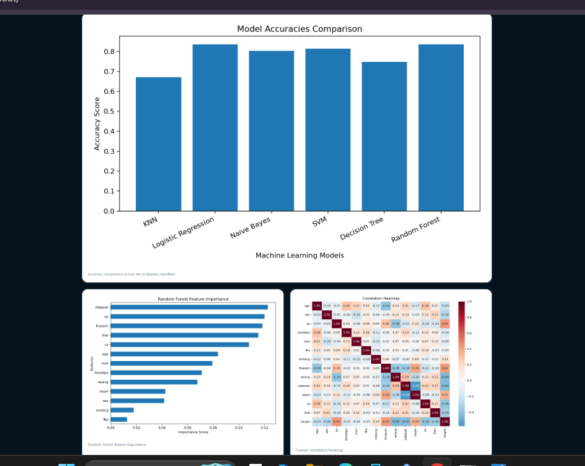

# CardioVeyra

## An Intelligent Machine Learning Framework for Heart Disease Prediction

CardioVeyra is a machine learning and web-based application developed for predicting the likelihood of heart disease using clinical patient parameters.

The project combines machine learning algorithms with a Django web interface to provide a simple and user-friendly heart disease prediction system.

> **Academic Project:** CardioVeyra is intended for educational and portfolio purposes and is not a certified medical diagnostic system.

---

## Project Overview

Heart disease is one of the major health challenges worldwide. Early identification of potential risk can support further medical evaluation.

CardioVeyra applies supervised machine learning algorithms to clinical data and predicts whether a patient falls into one of two classes:

- **0 — No heart disease indicated**
- **1 — Heart disease indicated**

The project uses the UCI Cleveland Heart Disease dataset containing **303 patient records** and **13 predictor features**.

The final web application uses a **Random Forest classifier** for prediction.

---

## Objectives

The main objectives of CardioVeyra are:

- Build a machine learning system for heart disease prediction.
- Compare multiple supervised machine learning algorithms.
- Train and evaluate classification models.
- Select a suitable final prediction model.
- Develop a Django-based web application.
- Provide a simple clinical parameter input form.
- Display the prediction and model probability.
- Visualize model performance and feature importance.
- Provide Dark Mode and Light Mode support.
- Create a reproducible academic machine learning project.

---

## Dataset

The project uses the **UCI Cleveland Heart Disease dataset**.

### Dataset Information

| Property | Value |
|---|---|
| Dataset | UCI Cleveland Heart Disease |
| Records | 303 |
| Predictor Features | 13 |
| Target Variable | `target` |
| Classification | Binary |
| Final Model | Random Forest |

### Features

The model uses the following 13 clinical parameters:

| Feature | Description |
|---|---|
| `age` | Age of the patient |
| `sex` | Sex of the patient |
| `cp` | Chest pain type |
| `trestbps` | Resting blood pressure |
| `chol` | Serum cholesterol |
| `fbs` | Fasting blood sugar |
| `restecg` | Resting electrocardiographic results |
| `thalach` | Maximum heart rate achieved |
| `exang` | Exercise-induced angina |
| `oldpeak` | ST depression induced by exercise |
| `slope` | Slope of the peak exercise ST segment |
| `ca` | Number of major vessels |
| `thal` | Thalassemia-related categorical value |

### Target

The target variable is binary:

```text
0 = No heart disease indicated
1 = Heart disease indicated
```

---

## Machine Learning Methodology

The project compares the following machine learning algorithms:

1. K-Nearest Neighbors (KNN)
2. Logistic Regression
3. Gaussian Naive Bayes
4. Support Vector Machine (SVM)
5. Decision Tree
6. Random Forest

### Training Configuration

The final training methodology uses:

```text
Train/Test Split: 80% / 20%
Random State: 0
KNN Neighbors: 7
SVM Kernel: Linear
Random Forest Estimators: 100
```

The final application model is:

```text
Random Forest Classifier
```

The trained Random Forest model is saved as:

```text
models/heartrf.joblib
```

---

## Application Workflow

```text
User
 │
 ▼
CardioVeyra Web Interface
 │
 ▼
Enter 13 Clinical Parameters
 │
 ▼
Input Validation
 │
 ▼
Trained Random Forest Model
 │
 ▼
Binary Prediction
 │
 ├── Class 0 → No heart disease indicated
 │
 └── Class 1 → Heart disease indicated
 │
 ▼
Predicted Model Probability
```

---

## Web Application

CardioVeyra provides a Django-based web interface with the following major sections.

### Home

The home page introduces CardioVeyra and provides navigation to the prediction and model information sections.

### Heart Disease Assessment

Users can enter the required 13 clinical parameters through the assessment form.

The application validates the input and sends the values to the trained machine learning model.

The result page displays:

- Prediction result
- Predicted class
- Model probability
- Interpretation of the prediction

### Model Information

The application also provides machine learning visualizations and information, including:

- Model comparison
- Feature importance
- Correlation heatmap
- Classification evaluation
- Confusion matrices
- Model-related visualizations

---

## Screenshots

### Home Page



### Heart Disease Assessment



### Prediction Result



### Model Analytics



---

## Technology Stack

### Programming Language

- Python

### Machine Learning

- Scikit-learn
- NumPy
- Pandas
- Joblib

### Web Framework

- Django

### Data Visualization

- Matplotlib
- Seaborn

### Frontend

- HTML
- CSS
- JavaScript

### Database

- SQLite

### Development Tools

- Git
- GitHub
- Python Virtual Environment

---

## Project Structure

```text
CardioVeyra/
│
├── data/
│   └── heart.csv
│
├── heart_prediction/
│   ├── migrations/
│   ├── templates/
│   ├── views.py
│   ├── urls.py
│   └── ...
│
├── models/
│   ├── heartrf.joblib
│   ├── best_heart_model.pkl
│   └── selected_features.pkl
│
├── predictor/
│   └── ...
│
├── screenshots/
│   ├── home.png
│   ├── assessment.png
│   ├── prediction.png
│   └── model.png
│
├── static/
│   ├── css/
│   └── js/
│
├── train_model.py
├── manage.py
├── requirements.txt
├── README.md
├── PROJECT_AUDIT.json
└── PROJECT_MANIFEST.json
```

---

## Installation

### 1. Clone the Repository

```bash
git clone https://github.com/itsrupsha/CardioVeyra.git
```

Move into the project directory:

```bash
cd CardioVeyra
```

### 2. Create a Virtual Environment

On Windows:

```bash
python -m venv venv
```

Activate the virtual environment:

```bash
venv\Scripts\activate
```

### 3. Install Dependencies

```bash
pip install -r requirements.txt
```

### 4. Train the Machine Learning Models

Run:

```bash
python train_model.py
```

This trains the machine learning models and generates the required model artifacts and evaluation outputs.

### 5. Start the Django Server

Run:

```bash
python manage.py runserver
```

Open the application in your browser:

```text
http://127.0.0.1:8000/
```

---

## Running the Application

After starting the Django development server:

1. Open the CardioVeyra home page.
2. Navigate to the assessment page.
3. Enter the 13 required clinical parameters.
4. Submit the assessment.
5. The trained Random Forest model processes the input.
6. The application displays the predicted class and model probability.
7. Visit the model section to view the machine learning visualizations.

---

## Theme Support

CardioVeyra includes a Dark Mode and Light Mode interface.

Users can switch between:

```text
Dark Mode
Light Mode
```

The selected theme is stored in browser local storage so that the preference can be retained.

---

## Model Evaluation

The project evaluates the machine learning models using classification metrics and visualizations.

The evaluation includes:

- Accuracy
- Precision
- Recall
- F1-score
- Confusion Matrix
- Model Comparison
- Feature Importance
- Correlation Analysis

The project stores generated evaluation outputs alongside the machine learning artifacts.

> Accuracy values should be taken directly from the final generated evaluation files rather than manually assumed.

---

## Important Machine Learning Details

The final project follows the following configuration:

```text
Dataset Records       : 303
Predictor Features    : 13
Target Classes        : 2
Train/Test Split      : 80% / 20%
Random State           : 0

KNN Neighbors          : 7
SVM Kernel             : Linear
Random Forest Trees    : 100

Final Application      : Random Forest
```

---

## Limitations

The project has several limitations:

- The dataset contains only 303 records.
- The dataset is static and does not represent real-time patient data.
- Machine learning predictions may contain false positives or false negatives.
- The system is designed for binary classification.
- The prediction model has not been clinically certified.
- The application should not replace professional medical examination.
- Real-world clinical deployment would require larger datasets, validation, security, privacy controls, and medical approval.

---

## Future Scope

Possible future improvements include:

- Larger and more diverse medical datasets.
- Additional machine learning and deep learning models.
- Hyperparameter optimization.
- Cross-validation and more extensive model validation.
- Explainable AI techniques such as SHAP.
- Real-time monitoring integration.
- Secure patient data management.
- User authentication and authorization.
- Deployment to a cloud platform.
- REST API integration.
- Improved accessibility and responsive design.
- Clinical validation with appropriate medical professionals.

---

## Documentation

Complete project documentation is included with the project package.

Available documentation:

```text
CardioVeyra_Project_Documentation.docx
CardioVeyra_Project_Documentation.pdf
```

The documentation covers:

- Project introduction
- Problem statement
- Objectives
- Dataset
- Data preprocessing
- Exploratory data analysis
- Machine learning algorithms
- Model evaluation
- Feature importance
- Web application
- Results
- Limitations
- Future scope
- Conclusion

---

## Reproducibility

To reproduce the project:

```bash
python -m venv venv
venv\Scripts\activate
pip install -r requirements.txt
python train_model.py
python manage.py runserver
```

The training configuration is explicitly defined in `train_model.py`.

---

## GitHub

Project repository:

**CardioVeyra — An Intelligent Machine Learning Framework for Heart Disease Prediction**

Repository:

```text
itsrupsha/CardioVeyra
```

---

## Disclaimer

CardioVeyra is an **academic machine learning project** developed for educational, demonstration, and portfolio purposes.

The predictions generated by this application are not medical diagnoses and should not be used as a substitute for professional medical advice, examination, or treatment.

Users should consult qualified healthcare professionals for medical decisions.

---

## Author

**Rupsha Das**

Areas of interest:

- Machine Learning
- Python
- Django
- Cybersecurity
- Software Development

---

## Project Status

**Completed Academic / Portfolio Project**

CardioVeyra demonstrates the integration of machine learning, data analysis, model evaluation, and Django web development into a complete end-to-end application.
